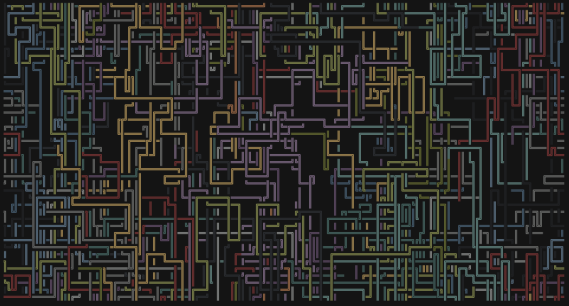
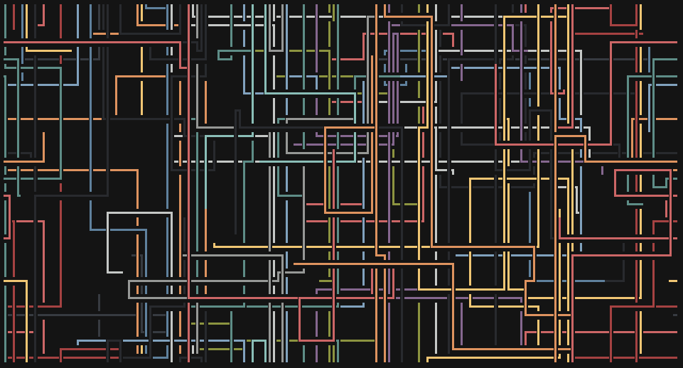
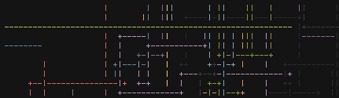
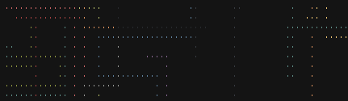
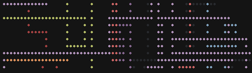
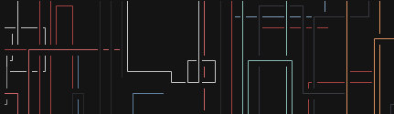
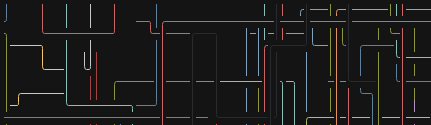
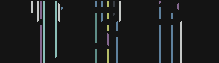
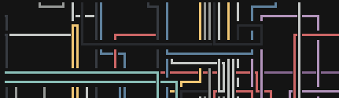

# rxpipes
This program is a 2D screensaver which recreates the Pipes screensaver from old MS Windows versions.

## Features
- Multiple sets of pieces (see the [Piece Sets](#piece-sets) section to see them)
- Each pipe has its own color, the available palettes are: none (colorless), base colors and RGB.
- Change the speed of drawing (FPS).
- The minimal and maximal length of pipes can be specified
- The maximal number of drawn characters can be also specified. To ignore this setting you can specify 0 via CLI.
- The probability of turning pipes is changeable, it's given as a percentage in decimal form.
Specifying 0 will make this program to draw straight pipes and 1 will make your screen look like...
umm... pseudo dragon curve or something like that?

## Screenshots

  
  

## Installation
You'll need the Rust toolchain ([rustup](https://rustup.rs/) or from system package repo) and make
sure it's up to date.

When the toolchain will be prepared, type `cargo install rxpipes`.

If you have installed successfully rxpipes, you can now run the it simply by typing `rxpipes`. If
the shell says that the command does not exists, make sure that `$HOME/.cargo/bin` (or whatever the
default cargo dir will be) is in the `PATH` environment variable.

To see all available options, pass `-h` or `--help`.

## Controls
| Key                  | Action |
|----------------------|--------|
| `q` / `Q` / `Escape` | Quit   |
| `Space`              | Pause  |

## Piece Sets

You can select a set by passing `-P <ID>` to rxpipes.

| ID | Description                     | Image                             |
|----|---------------------------------|-----------------------------------|
| 0  | ASCII pipes                     |  |
| 1  | Thin dots                       |  |
| 2  | Bold dots                       |  |
| 3  | Thin pipes                      |  |
| 4  | Thin pipes with rounded corners |  |
| 5  | Double pipes                    |  |
| 6  | Bold pipes                      |  |

*The look of the selected set may differ from the screenshots as it depends on the font that you use.*

## Contribution
If you have found a problem or have a suggestion, feel free to open an issue or send a pull request.
I'd appreciate it.

## License
The rxpipes project is licensed under the [MIT license](LICENSE.md).
