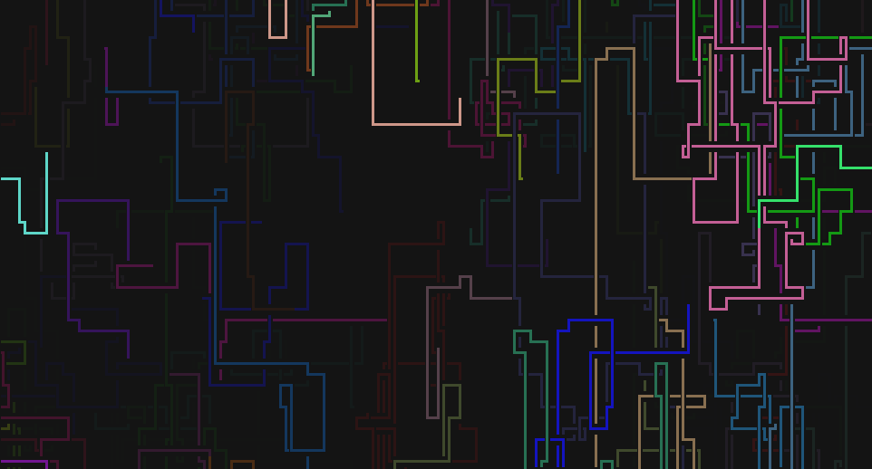
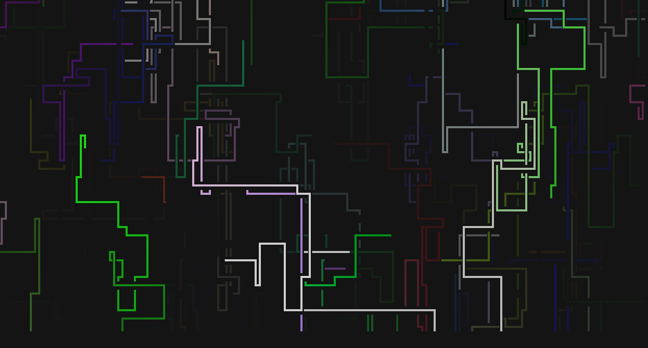
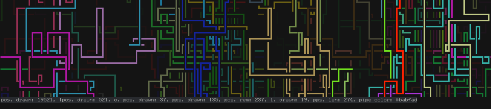

# rxpipes
This program is a 2D screensaver which recreates the Pipes screensaver from old MS Windows versions.

## Features
- 6 available piece sets (see the [Piece Sets](#piece-sets) section to see them).
- Custom piece sets are supported.
- **Depth mode** - in this mode several layers of pipes are drawn, and when a new layer is created,
old pipes are made darker which gives a sense of depth.
- Each pipe has its own color; available palettes are: none (colorless), base colors (16 colors
defined by your terminal) and RGB.
- There is a gradient mode for use with RGB palette.
- Changeable FPS (frames per second).
- The minimal and maximal length of pipes can be specified.
- The maximal number of drawn characters can be also specified. To ignore this setting specify 0
via CLI. The screen will be cleared when this number is reached.
- The probability of turning pipes is changeable, it's given as a percentage in decimal form (0 .. 1).
- It enters an alternate screen so it won't mess up your previous output (if your terminal does not
support alternate screen, see [Installation](#installation)).

## Screenshots

  
  
  
  
  

## Installation
You'll need the Rust toolchain ([rustup](https://rustup.rs/) or from system package repo) and make
sure it's up to date.

When the toolchain will be prepared, type `cargo install rxpipes`. If you want to disable the
alternate screen feature, add `--no-default-features` (currently, cargo does not support disabling
of individual features).

If you have installed successfully rxpipes, you can now run the it simply by typing `rxpipes`. If
the shell says that the command does not exists, make sure that `$HOME/.cargo/bin` (or whatever the
default cargo dir will be) is in the `PATH` environment variable.

To see all available options, pass `-h` or `--help`.

## Controls
| Key                  | Action                      |
|----------------------|-----------------------------|
| `q` / `Q` / `Escape` | Quit                        |
| `Space`              | Pause                       |
| `c`                  | Clear screen                |
| `s`                  | Show stats widget           |
| `l`                  | Clear and redraw everything |

## Piece Sets

You can select a set by passing `-P <ID>` to rxpipes.

| ID | Description                     | Image                             |
|----|---------------------------------|-----------------------------------|
| 0  | ASCII pipes                     |  |
| 1  | Thin dots                       |  |
| 2  | Bold dots                       |  |
| 3  | Thin pipes                      |  |
| 4  | Thin pipes with rounded corners |  |
| 5  | Double pipes                    |  |
| 6  | Bold pipes (default)            |  |

*The look of the selected set may differ from the screenshots as it depends on the font that you use.*

To set your own piece set see the `-c`/`--custom-piece-set` flag in the help message (`-h`).

## Contribution
If you have found a problem or have a suggestion, feel free to open an issue or send a pull request.
I'd appreciate it.

## License
The rxpipes project is licensed under the [MIT license](LICENSE.md).
